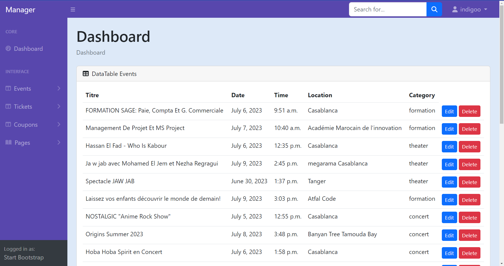

# Event Ticket Reservation

This is a web application for event ticket reservation built using Django.

## Table of Contents

- [Introduction](#introduction)
- [Screenshots](#Screenshots)
- [Features](#features)
- [Installation](#installation)
- [Usage](#usage)
- [Contributing](#contributing)
- [License](#license)

## Introduction

Event Ticket Reservation is a Django-based web application that allows users to reserve tickets for various events. The application offers a user-friendly interface for both event organizers and attendees.

## Screenshots

Event App: 


Dashboard Admin:


Dashboard Manager:



## Features

- User authentication and registration.
- Event creation, management, and ticket reservation.
- Dashboard for event organizers and attendees.
- Payment integration for ticket booking.
- Responsive design for a seamless experience across devices.

## Installation

1. **Clone the Repository:**

   ```bash
   git clone https://github.com/yourusername/event-ticket-reservation.git
   cd event-ticket-reservation

2. **Create a Virtual Environment:**
   ```bash
   python -m venv venv
   source venv/bin/activate  # On Windows: venv\Scripts\activate
   
3. **Install Dependencies:**
   ```bash
   pip install -r requirements.txt

4. **Apply Migrations:**
   ```bash
   python manage.py migrate

5. **Create a Superuser:**
   ```bash
   python manage.py createsuperuser


## Usage
1. **Run the Development Server:**
   ```bash
   python manage.py runserver

2. **Access the Application:**

Open your web browser and go to http://127.0.0.1:8000/.

3. **Login and Explore:**

Log in using your superuser account. Create events, reserve tickets, and manage events from the admin dashboard.

## Contributing
Contributions are welcome! Fork the repository, create a new branch, and submit a pull request.

## License

This project is licensed under the [MIT License](./LICENCE).